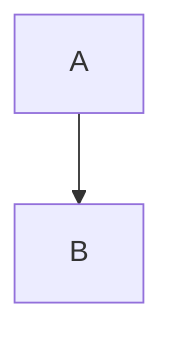

# NLE-TMS后端开发文档

## 一、项目介绍
### 1. 概述
  TMS全称Transportation Management System，即运输管理系统。TMS是恩尔伊科技公司重要开发运营项目之一，主要承接荷兰快递公司的快递业务以及欧亚商城的送货业务。  
### 2. 技术介绍
该项目于2019年年末进行筹备，2020年1月进行正式开发，首要需求为满足荷兰方的运输管理需求，分担ERP项目的部分功能，其次计划将该产品推向国内，服务国内小型运输公司。本项目采取前后端分离模式，后端基于php+mysql+redis利用Laravel框架开发，前端基于css+javascript利用vue框架开发。  
php版本：7.4.6  
mysql版本：5.7.11  
redis版本：  
laravel版本：6.18.27  

### 3. 主要开发人员
  产品经理：**曾纯**，**宁羚**  
  后端主程序员：**龙放耀**  
  后端程序员：**胡洋铭**，**唐睦州**，**霍张启**  
  前端主程序员：**何家群**  
  前端程序员：**苏宇**，**方丹**  
### 4. 相关材料
  
正式服管理员端地址：[https://tms-admin.eutechne.com](https://tms-admin.eutechne.com)  
正式服商户端地址：[https://tms-business.eutechne.com](https://tms-business.eutechne.com)  
开发服管理员端地址：[https://dev-tms-admin.nle-tech.com](https://dev-tms-admin.nle-tech.com)  
开发服商户端地址：[https://dev-tms-business.nle-tech.com](https://dev-tms-business.nle-tech.com)  
  
## 二、项目部署
### 1.搭建环境
#### 1.1 安装docker
Docker 是一个开源的应用容器引擎，可以让开发者打包他们的应用以及依赖包到一个轻量级、可移植的容器中，然后发布到任何流行的 Linux 机器上，也可以实现虚拟化。本项目的开发服，正式服均是由docker搭建环境。开发服与正式服的服务器均是CentOS系统，首先通过相关教程将Docker安装至服务器。  
安装方法见**1.2** docker-compose的安装方法。

#### 1.2 安装docker-compose
docker-compose 是用于定义和运行多容器 Docker 应用程序的工具。通过 docker-compose，您可以使用 YML 文件来配置应用程序需要的所有服务。然后，使用一个命令，就可以从 YML 文件配置中创建并启动所有服务。  
安装方法地址：[https://www.runoob.com/docker/docker-compose.html](https://www.runoob.com/docker/docker-compose.html)
#### 1.3 配置&启动服务
从github上获取配置文件。
```gitexclude
git clone https://github.com/balloontmz/php_docker_env;
```
构建容器。
```
docker-compose build;
```
启动服务。
```
docker-compose up -d;
```
查看运行情况。
```
docker-compose ps；
```
如果运行正常，以下状态均应为up。
>tms_dev_env_crontab_1  
tms_dev_env_mysql_1  
tms_dev_env_nginx_1  
tms_dev_env_php-cli_1  
tms_dev_env_php-fpm_1  
tms_dev_env_phpmyadmin_1  
tms_dev_env_redis_1  

按顺序分别为定时任务，数据库，服务器，php命令行，php扩展，数据库网页版，缓存。其中还有supervisor及wkhtmltopdf安装在php-cli的虚拟容器中，因为某些原因并未单独拿出来作为容器管理。

### 2. 项目部署与维护
该项目利用github进行代码管理，放置在nle-tech的仓库中，其中正式服分支为deploy，开发服分支为develop。  
#### 2.1 安装git
访问git官网下载git。  
下载地址：[https://git-scm.com/downloads](https://git-scm.com/downloads)
#### 2.2 从github上下载项目工程
 github仓库地址：[https://github.com/nletech/tms-api](https://github.com/nletech/tms-api)
通过克隆，下载到服务器上。
```gitexclude
git clone https://github.com/nletech/tms-api/tree/deploy;
```
#### 2.3 更新
以开发服为例，在本地克隆后，在项目目录下，对代码进行了任何更改，可首先将代码上传到开发服仓库上。
```
git push 
```
然后在开发服进行拉取
```gitexclude
git pull
```
如果有通过数据迁移文件对数据库修改，还需进入容器，执行以下命令进行数据迁移。
````gitexclude
docker-compose exec php-cli bash
cd api
php aritsan migrate
````
如果有更改队列任务，还需进入容器，执行以下命令重启队列。
```gitexclude
docker-compose exec php-cli bash
cd api
supervisorctl restart all
```

### 3. 初始化项目
#### 3.1 nginx配置
在服务器上/etc/nginx/conf.d/文件夹中，新建.conf配置文件，在service下加上以下配置：  
```
client_max_body_size 50M;
client_body_buffer_size 1024M;
```
#### 3.2 框架初始化
在根目录下，根据.env.example编写.env文件。  
生成APP秘钥。  
```
php artisan key:generate
```
生成软连接
```
php artisan storage:link
```
#### 3.3 数据库初始化
```
php artisan migrate
```
#### 3.4 缓存初始化
地址模板缓存  
```
php artisan address-template:cache
```
邮编缓存
```
php artisan postcode:cache
```
国家缓存
```
php aritsan country:cache
```
#### 3.5 配置supervisor
由于某些原因，supervisor并未以容器的形式进行管控，而是在php-cli容器中进行了安装，仅此需要解决supervisor配置问题，每次重启后均需重新配置。
进入docker目录，执行以下命令：
``` 
docker-compose exec php-cli bash
cd api
sudo supervisord -c /etc/supervisor/supervisord.conf
```
## 三、使用说明
### 1. 项目连接
#### 1.1 内部连接
TMS项目后端与管理员端，商户端，司机端进行连接，其中管理员端与商户端为网页端，司机端为安卓端。  
开发服管理员端接口地址：[https://dev-tms.nle-tech.com/api/admin](https://dev-tms.nle-tech.com/api/admin)  
正式服管理员端接口地址：[https://tms-admin.eutechne.com/api/admin](https://tms-admin.eutechne.com/api/admin)  
开发服商户端接口地址：[https://dev-tms.nle-tech.com/api/merchant](https://dev-tms.nle-tech.com/api/merchant)  
正式服商户端接口地址：[https://tms-admin.eutechne.com/api/merchant](https://tms-admin.eutechne.com/api/merchant)  
开发服司机端接口地址：[https://dev-tms.nle-tech.com/api/driver](https://dev-tms.nle-tech.com/api/driver)  
正式服司机端接口地址：[https://tms-admin.eutechne.com/api/driver](https://tms-admin.eutechne.com/api/driver)  
#### 1.2 业务外部连接
TMS项目可通过API与其他系统进行交互，目前仅对接ERP和欧亚商城。
##### 1.2.1 响应
第三方系统可以通过请求以下接口进行订单新增等主动操作，TMS系统会进行响应。
开发服第三方接口地址：[https://dev-tms.nle-tech.com/api/merchant_api](https://dev-tms.nle-tech.com/api/merchant_api)  
正式服第三方接口地址：[https://tms-admin.eutechne.com/api/merchant_api](https://tms-admin.eutechne.com/api/merchant_api)  
##### 1.2.2 推送
TMS系统可以在公司配置-商家配置中的API授权菜单中，设置第三方接收URL。TMS系统会将信息推送到此地址。

#### 1.3 功能外部连接
TMS系统目前利用到的第三方接口有谷歌地图API，腾讯地图API，postcode.nl，公司内部的谷歌API服务(暂行办法)。智能优化，距离计算等功能的正常运作需要以上第三方接口生效，因此请在项目根目录下的.env文件中对各个接口进行正确配置。  
除此之外，本项目有自动翻译的功能，如果需要用到该功能，还需调用百度翻译API。
谷歌地图API地址：[https://maps.googleapis.com/maps/api](https://maps.googleapis.com/maps/api)  
谷歌地图API文档：[https://developers.google.com/maps/documentation](https://developers.google.com/maps/documentation)  
腾讯地图API地址：[https://apis.map.qq.com/ws/distance/v1/optimal_order](https://apis.map.qq.com/ws/distance/v1/optimal_order)  
腾讯地图API文档：[https://lbs.qq.com](https://lbs.qq.com)  
公司内部的谷歌API服务：[https://tms.exss.io](https://tms.exss.io)  
postcode.nl网站API地址：[https://api.postcode.nl/rest](https://api.postcode.nl/rest)  
百度翻译API地址：[http://api.fanyi.baidu.com/api/trans/vip/translate](http://api.fanyi.baidu.com/api/trans/vip/translate)
百度翻译文档：[https://api.fanyi.baidu.com/doc/21](https://api.fanyi.baidu.com/doc/21)

### 3. 业务流程
#### 3.1 功能概论

### 4. 其他说明
#### 4.1 自定义命令
在Laravel框架下，拥有便利的自定义artisan命令。在项目目录下的app/Console/Commonds文目录内，存放有所有的自定义aritsan命令，其中可用的有以下命令。  
##### 4.1.1 抛错自动翻译
```
php artisan translate
```
原理是获取/app目录下中所有的引号或者双引号内，且首字为汉字的所有字符。然后通过调用百度翻译API，将所有字段翻译成英语与荷兰语。最后写入resources/lang文目录下的语言文件。  
如需手动修改翻译，仍旧可以在语言文件中修改。因为此命令只会新增原语言文件中没有的键，不会覆盖已有的键对应的值。  
由于某些原因，荷兰语翻译中的变量会有异常，需要手动处理。 
##### 4.1.2 字段自动翻译
```
php artisan validate
```
字段自动翻译，原理是获取数据库中所有字段的备注，并且翻译，后续过程与抛错自动翻译一致。  
##### 4.1.3 数据库备份
```
php artisan db:backup
```
备份以sql语句的形式，经过压缩后存储在/storage/backup下。定时任务会在APP时区每日1点调用该命令，进行覆盖储存。  
##### 4.1.4 socket通讯推送
```
php artisan admin:push {id : the admin u_id} {type : the push type}
```
##### 4.1.4 订单签收重推
```
php artisan repush {--order_no= : order_no} {--tour_no= : tour_no}
```
##### 4.1.5 重推
```
php artisan test:guzzle {url}
```
该命令需要在app/Console/Commands/TestGuzzle.php中按格式填构建请求数据，然后填写所需第三方Url，此命令适用于所有第三方推送。  
##### 4.1.6 解锁取件线路的操作锁定
```
php artisan unlock:tour {tour_no}
```
如果智能调度时出现“当前 tour 正在操作中,请稍后操作”报错，可使用该命令对取件线路进行解锁。  

### 四 代码规范
#### 4.1 命名
表名采用小蛇形命名法，字母全部小写，通过下划线连接。  
字段名采用小蛇形命名法，字母全部小写，通过下划线连接。 
常量名采用大蛇形命名法，字母全部大写，通过下划线连接。 
变量名采用小驼峰命名法，除第一个单词外其他单词首字母大写。  
函数名采用小驼峰命名法，除第一个单词外其他单词首字母大写。  
类名采用大驼峰命名法，所有单词首字母大写。  
#### 4.2 目录结构
目录结构大体按照Laravel框架设置，不同点如下：  
##### 4.2.1 新增app/Services目录
该文件目录存放主要业务逻辑。app/Http/Controller只作为从route到service的连接桥梁，而app/Models中只存放与数据库交互的相关代码。Services目录下按照不同端分为几个子文件目录，每个端之间无法互相调用。虽然这样做会造成一部分代码重复冗余，但也是为了保证代码分离，如果有需要，可以快速将原项目代码拆分为各个端独立的代码。  
##### 4.2.2 新增app/Http/validate目录
该目录下存放各个接口的表单验证规则。与Serivces一样，validate目录也按照不同端分为几个子目录。通过validate中间件，可以将validate自动绑定到service上，自动绑定的条件是validate文件与service文件拥有共同前缀，例如，orderService与OrderValidate。亦可在Service文件中，手动调用validate类，或者调用底层validator::make()静态方法。  
##### 4.2.3 新增app/Exports目录
该目录下存放所有的导出模板。
##### 4.2.4 新增app/Imports目录
该目录下存放所有的导入模板。
##### 4.2.5 新增app/Mail目录
该目录下存放邮件发送相关代码。  
##### 4.2.6 新增app/Worker目录
该目录下存放即时通讯相关代码。
##### 4.2.7 新增config/tms.php文件
该文件储存环境配置路径，所有业务代码只能通过该文件访问.env里的环境配置。这样做是为了安全性与统一管理。
该目录下存放即时通讯相关代码。
#### 4.3 设计通例
##### 4.3.1 Service相互之间的调用
在一个service中，通过getInstance方法构造单例，从而调用其他service。controller等其他类大多数无法进行同级调用。
##### 4.3.2 基类继承
在service目录下，有一个BaseService作为基类，该类中存有较为通用的方法。其他所有service类都继承这个基类，又根据业务需求分别拥有特殊方法。并且，可以通过复写基类中的方法对其通用方法进行定制。既可以减少代码重复性，又不缺乏灵活性。除了service，其他所有的类都可以以此方法构建通用基类，提高代码复用率。如果某一类service除了BaseService外，仍然有较多相同代码，可以在BaseService与Serice之间再加一层通用类，例如由于按区域分配订单与按邮编分配订单这两个服务，拥有部分共同的处理步骤，所以在AreaService与BaseService之间，新建BaseLineService。
##### 4.3.3 上传文件目录结构
用户上传的文件在app/public/storage目录下，根据不同端分为admin，driver，merchant三个文件夹，在此之下再根据文件类型分文件夹，例如，barcode，excel，flie等。结构形如app/public/storage/admin/excel。一般情况下不要改变该结构，不要在文件类型目录下再建更多子目录，那样做的话会难以管理。
